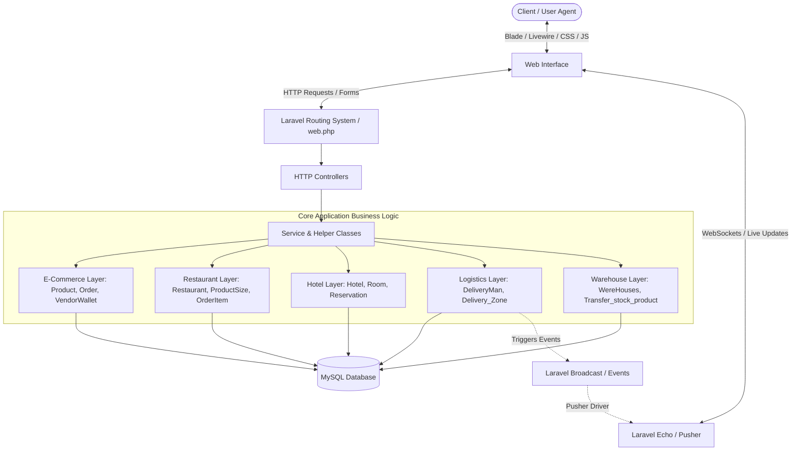

# EasyCommerce 🚀

[](https://laravel.com)
[](https://livewire.laravel.com)
[](https://getbootstrap.com)
[](https://php.net)
[](LICENSE)

EasyCommerce is an enterprise-grade, multi-vendor, multi-service digital commerce platform built on the modern **Laravel 10**, **Livewire 3**, and **Bootstrap 5** stack. It unifies traditional **Retail E-Commerce**, **Restaurant & Food Delivery**, and **Hotel/Accommodation Booking** into a single cohesive ecosystem, complete with warehouse management, automated logistics assignment, and real-time delivery tracking.

---

## 🏗️ Architectural Overview & System Design

EasyCommerce is architected using a decoupled modular domain pattern implemented on top of the traditional Model-View-Controller (MVC) system of Laravel.

### High-Level System Architecture Diagram



### Architectural Layers Detailed

#### 1. Presentation & Reactive UI Layer (Frontend)
*   **Blade Templates & SCSS:** Formulate the base structure and styling using Bootstrap 5.
*   **Livewire 3 Component Engine:** Manages reactive client states (e.g., adding to cart, sorting products, real-time ratings, checkouts) without writing custom API endpoints or heavy Javascript SPA setups.
*   **Pusher & Laravel Echo:** Subscribes client browsers to WebSocket channels for instant UI updates (such as message notification badges and live delivery courier tracking pins on interactive maps).

#### 2. Routing & Middleware Security Layer
*   **Authentication Middlewares:** Custom guards separating access between regular `Users`, system `Admins`, `Vendors` (with multi-business vendor context), and `DeliveryMan`.
*   **Facade Shorthands:** Artisan utility access for clearing application states during continuous delivery.

#### 3. Application Logic Layer (Controllers & Services)
*   Controllers orchestrate HTTP requests and view compilation (located in domain namespaces inside `app/Http/Controllers/` such as `Admin`, `Delivery`, `Ecommerce`, `Restaurant`, and `Hotel`).
*   Helper functions handle shared functions (like pricing conversions, barcode generation, image uploads, and alerts).

#### 4. Core Domain & Persistence Layer (Models & Database)
*   Uses Laravel Eloquent ORM mapping to represent database entities.
*   Organized modularly:
    *   **Global/Core Domain:** Brands, Categories, Users, Banners, Activity Logs.
    *   **Restaurant Subdomain:** Menu items, cuisines, sizes, and cart handling under `App\Models\Restaurant`.
    *   **Hotel Subdomain:** Reservations, room specifications, and amenity structures under `App\Models\Hotel`.
    *   **Financial & Vendor Wallets:** Ledger entries for transactions, balance withdraw tracking, and commissions.

#### 5. Event-Driven & Messaging Layer
*   **Laravel Broadcast System:** Fires background events linked to WebSocket push notifications.
*   **Key Events:**
    *   `DeliveryManLocationUpdated`: Dispatches geo-coordinates (lat/lng) of delivery couriers to real-time maps.
    *   `MessageSent`: Facilitates instant chat communication between customers, vendors, and support desks.

---

## 🌟 Core Modules & Features

### 1. 🛍️ E-Commerce (Retail)
*   **Multi-Vendor Architecture:** Independent vendor registration, automated payout configurations, and distinct vendor dashboards.
*   **Product Management:** Attribute variations (color, size, weight), custom coupon management, flash deals, seasonal products, and multi-image galleries.
*   **Frictionless Checkout:** Guest and authenticated shopping carts, direct checkout options, shipping zone calculators, and tax configurations.
*   **Integrated Payment Gateways:** Seamless integration with **PayPal** and local East-African payment gateways such as **Chapa**.
*   **Wishlist & Social Shares:** Built-in wishlist systems and social sharing capabilities via `laravel-share`.

### 2. 🍔 Restaurant & Food Delivery
*   **Interactive Digital Menus:** Dynamic categorization, preparation modifiers, and multiple food sizing options.
*   **Call Center Order Dispatching:** Dedicated dashboard panel for manual call center operators to dispatch restaurant orders.
*   **Automated Logistics Assignment:** Seamlessly hand off orders to delivery men based on geographic zones.

### 3. 🏨 Hotel & Accommodation Booking
*   **Room & Suite Management:** Custom room types, availability calendars, and granular room pricing rules.
*   **Amenity & Photo Management:** Custom amenity lists and responsive image galleries for hotel listings.
*   **Reservations & Reviews:** Direct booking scheduling, checkout management, and verified customer review systems.

### 4. 🚚 Logistics & Real-Time Delivery Boy Ecosystem
*   **Live Map Tracking:** Interactive maps for both administrators and customers using **Pusher** and **Laravel Echo** for real-time coordinate syncing.
*   **Delivery Zone Mapping:** Geofenced delivery zone constraints, vehicle classifications, and custom tip settings.
*   **Payout & Withdrawals:** Comprehensive delivery agent payment management with withdraw request pipelines.

### 5. 📦 Warehouse & Inventory Control
*   **Multi-Warehouse Tracking:** Real-time stock counts across multiple storage hubs.
*   **Stock Keepers (Stock Capers) System:** Hand off specific warehouses to designated managers.
*   **Goods Receiving Notes (GRN):** Structured inventory ingestion flow with PDF invoices.
*   **Inter-Warehouse Transfers:** Request, approve, and track stock movements between different storage locations.

### 6. 📊 Reports & Analytics
*   **Interactive Visual Charts:** Dynamic data representation using **Chart.js** and **Larapex Charts** for sales, stock depletion, transfer history, and customer activity.
*   **Comprehensive Logging:** Admin activity log reporting to track crucial database transactions.

---

## 🛠️ Technology Stack

| Layer | Technology |
| :--- | :--- |
| **Backend Framework** | Laravel 10.x |
| **Frontend Rendering** | Blade Templates, Livewire 3.x |
| **UI Styling** | Bootstrap 5.2.3, Sass/SCSS |
| **Real-time Server** | BeyondCode Laravel WebSockets, Pusher PHP Server |
| **Database System** | MySQL / MariaDB |
| **Image Processing** | Intervention Image 3.x |
| **Document Generation** | DomPDF |
| **Asset Compiler** | Vite 5.x |

---

## 📋 System Requirements

Ensure your environment meets the following baseline requirements:
*   **PHP** `^8.1`
*   **Composer** `^2.2`
*   **Node.js** `^18.x` & **NPM** `^9.x`
*   **MySQL** `^8.0` or **MariaDB** `^10.4`
*   Extensions enabled in `php.ini`: `gd`, `zip`, `pdo_mysql`, `bcmath`, `ctype`, `fileinfo`, `openssl`, `mbstring`, `xml`

---

## ⚙️ Installation & Local Setup

Follow these steps to configure EasyCommerce on your local environment:

### 1. Clone the Repository
```bash
git clone https://github.com/your-username/easycommerce.git
cd easycommerce
```

### 2. Install Dependencies
Install PHP dependencies via Composer and frontend packages via NPM:
```bash
composer install
npm install
```

### 3. Environment Configuration
Copy the sample environment file and generate a unique application key:
```bash
cp .env.example .env
php artisan key:generate
```

Open `.env` in your editor and configure your database and broadcast settings:
```env
DB_CONNECTION=mysql
DB_HOST=127.0.0.1
DB_PORT=3306
DB_DATABASE=easycommerce_db
DB_USERNAME=your_username
DB_PASSWORD=your_password

# Broadcast driver for real-time tracking:
BROADCAST_DRIVER=pusher

# Setup local websocket variables:
PUSHER_APP_ID=local-id
PUSHER_APP_KEY=local-key
PUSHER_APP_SECRET=local-secret
PUSHER_HOST=127.0.0.1
PUSHER_PORT=6001
PUSHER_SCHEME=http
```

### 4. Database Setup & Migrations
Create the database in your database management system, then run migrations and seed necessary baseline tables:
```bash
php artisan migrate --seed
```

### 5. Storage Symbolic Link
Create the public symlink for user uploads, product assets, and invoices:
```bash
php artisan storage:link
```

### 6. Compile Frontend Assets
Run Vite in development mode to compile SCSS and Javascript:
```bash
npm run dev
```

### 7. Run the Application
Open a new terminal session and start the PHP built-in server:
```bash
php artisan serve
```

### 8. Run the Real-Time WebSocket Server
To enable live map tracking for delivery men, start the local websocket server:
```bash
php artisan websockets:serve
```
The application will now be accessible at `http://127.0.0.1:8000`.

---

## ⚡ Developer & Maintenance Utilities

EasyCommerce comes with built-in artisan shorthand routes to easily reset configs during development. Access these in your browser:

*   **Clear App Cache:** `http://localhost:8000/clear-cache`
*   **Reoptimize Application:** `http://localhost:8000/optimize`
*   **Cache Application Routes:** `http://localhost:8000/route-cache`
*   **Clear Route Cache:** `http://localhost:8000/route-clear`
*   **Clear View Cache:** `http://localhost:8000/view-clear`
*   **Clear Config Cache:** `http://localhost:8000/config-cache`

---

## 🔒 Security Vulnerabilities

Please review our codebase security protocols. If you discover a vulnerability, do not open a public issue. Email the development leads directly to coordinate patches.

---

## 📄 License

The EasyCommerce platform is open-sourced software licensed under the [MIT license](LICENSE).
